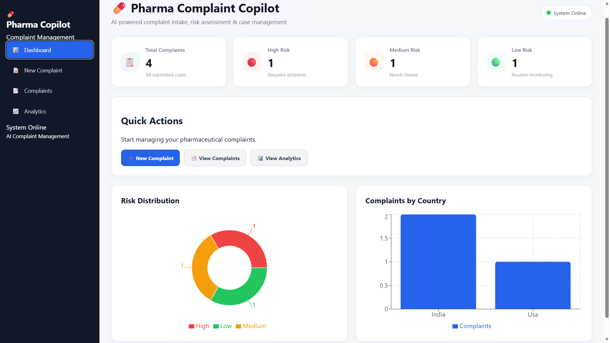
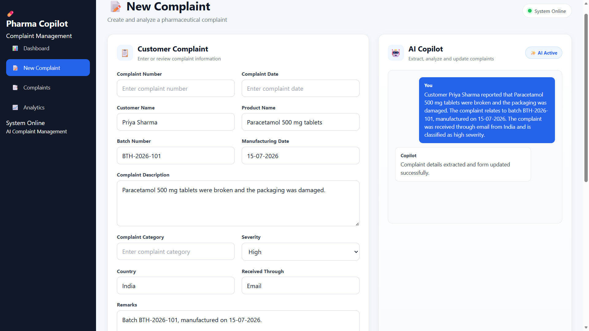
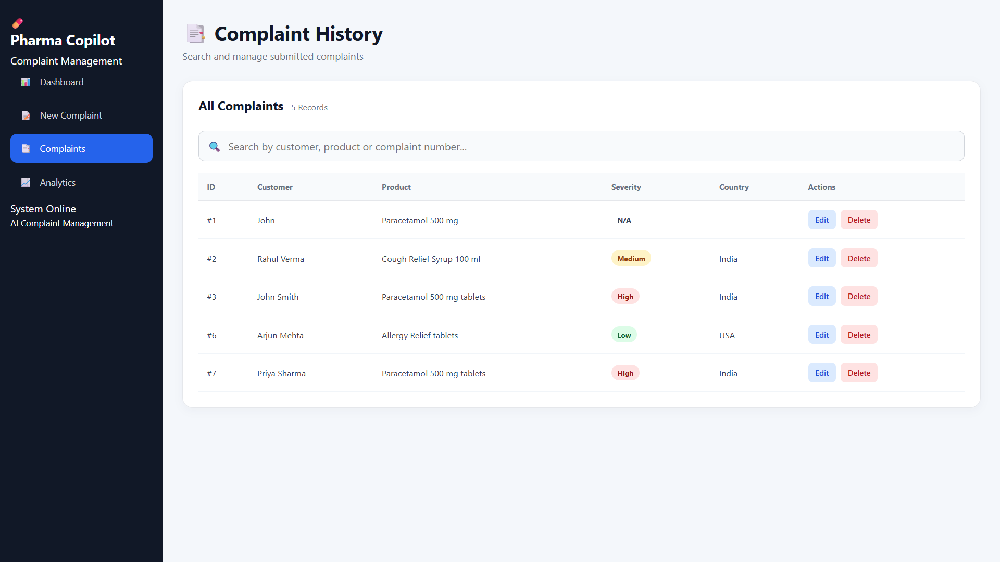
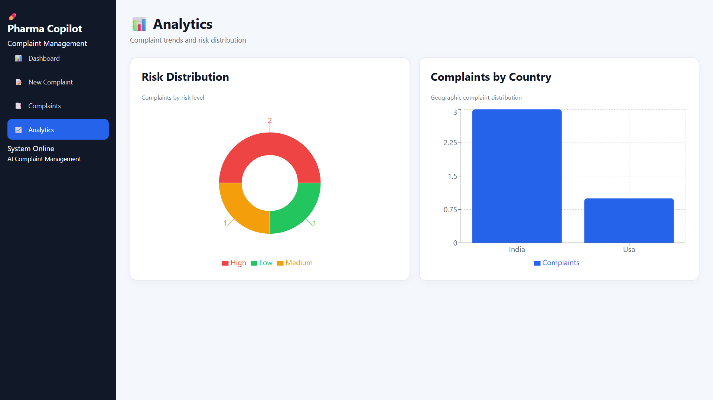

# 💊 Pharma Complaint Copilot

**Pharma Complaint Copilot** is a full-stack AI-powered pharmaceutical complaint management application designed to simplify complaint intake, analysis, risk assessment, storage, and reporting.

## 🚀 Project Overview

The application allows users to enter pharmaceutical complaints manually or through an AI Copilot. Complaint information can be analyzed, assessed for risk, stored, searched, edited, deleted, and converted into PDF reports.

The project consists of:

* React frontend
* FastAPI backend
* REST API communication
* AI-assisted complaint processing
* Complaint management
* Risk assessment
* Dashboard analytics
* PDF upload and generation
* Cloud deployment

---

## ✨ Features

### 🤖 AI Complaint Copilot

Users can describe a complaint in natural language. The AI Copilot processes the information and updates the complaint form.

### 🛡️ Risk Assessment

The application provides risk assessment based on complaint information:

* 🔴 High
* 🟠 Medium
* 🟢 Low

It also generates:

* Complaint summary
* Risk level
* Risk reason

### 📋 Complaint Management

Users can:

* Create complaints
* Save complaints
* Edit complaints
* Delete complaints
* Search complaint history
* View submitted complaints

### 📄 PDF Features

The application supports:

* PDF complaint upload
* Complaint information extraction
* Complaint report generation
* PDF download

### 📊 Dashboard

The dashboard displays:

* Total complaints
* High-risk complaints
* Medium-risk complaints
* Low-risk complaints
* Risk distribution
* Complaints by country

---

## 🏗️ Application Architecture

```text
User
 │
 ▼
React + Vite Frontend
 │
 │ REST API
 ▼
FastAPI Backend
 │
 ├── Complaint Management
 ├── AI Processing
 ├── Risk Assessment
 ├── PDF Processing
 └── Dashboard Analytics
 │
 ▼
Complaint Data
```

---

## 🛠️ Technology Stack

### Frontend

* React
* Vite
* React Router
* Redux Toolkit
* Recharts
* CSS

### Backend

* Python
* FastAPI
* REST API
* ReportLab
* PDF processing

### Development & Deployment

* Git
* GitHub
* Vercel
* Render
* VS Code

---

## 📂 Project Structure

```text
complaint-management-ai/
│
├── frontend/
│   ├── src/
│   │   ├── components/
│   │   │   └── Sidebar.jsx
│   │   ├── features/
│   │   │   ├── chatSlice.js
│   │   │   └── formSlice.js
│   │   ├── App.jsx
│   │   └── ...
│   ├── package.json
│   └── ...
│
├── backend/
│   ├── main.py
│   ├── requirements.txt
│   └── ...
│
└── README.md
```

---

## 🔌 Backend API

The frontend communicates with the deployed backend through REST API endpoints.

| Method | Endpoint          | Purpose                       |
| ------ | ----------------- | ----------------------------- |
| GET    | `/complaints`     | Retrieve complaint history    |
| GET    | `/dashboard`      | Retrieve dashboard statistics |
| POST   | `/chat`           | Process AI complaint input    |
| POST   | `/update`         | Update complaint fields       |
| POST   | `/submit`         | Save a new complaint          |
| PUT    | `/complaint/{id}` | Update an existing complaint  |
| DELETE | `/complaint/{id}` | Delete a complaint            |
| POST   | `/upload`         | Upload and process a PDF      |
| POST   | `/generate-pdf`   | Generate a complaint PDF      |

---

## 🌐 Deployment

The application is deployed using separate frontend and backend services.

### Frontend

**Vercel**

### Backend

**Render**

The production frontend communicates with the deployed FastAPI backend.

---

## ⚙️ Local Installation

### 1. Clone the repository

```bash
git clone https://github.com/Pranjali-0712/complaint-management-ai.git
cd complaint-management-ai
```

### 2. Setup Backend

```bash
cd backend
```

Create a virtual environment:

```bash
python -m venv .venv
```

Activate it on Windows:

```bash
.venv\Scripts\activate
```

Install dependencies:

```bash
pip install -r requirements.txt
```

Start the backend:

```bash
uvicorn main:app --reload
```

### 3. Setup Frontend

Open another terminal:

```bash
cd frontend
```

Install dependencies:

```bash
npm install
```

Start the development server:

```bash
npm run dev
```

The frontend will normally run on:

```text
http://localhost:5173
```

---

## 🔗 Production API Configuration

The production frontend uses the deployed backend API:

```javascript
const API_URL = "https://complaint-management-ai.onrender.com";
```

---

## 📸 Screenshots

Add screenshots of the following sections:

### Dashboard



### New Complaint



### AI Copilot


### Complaint History



### Analytics



---

## 🎯 Key Learning Outcomes

This project demonstrates practical experience with:

* Full-stack web development
* React application development
* REST API integration
* FastAPI backend development
* Redux state management
* AI-assisted data processing
* CRUD operations
* PDF processing
* Data visualization
* Git and GitHub
* Cloud deployment
* Frontend-backend integration

---

## 🔮 Future Enhancements

* User authentication
* Role-based access control
* PostgreSQL/MySQL database
* Advanced AI risk classification
* Email notifications
* Complaint status workflow
* Audit logs
* Multi-language support
* Advanced analytics
* Cloud document storage

---

## 👩‍💻 Developer

**Pranjali Tiwari**

Computer Science & Engineering

GitHub: **Pranjali-0712**

---

## ⭐ Project Highlights

**Pharma Complaint Copilot** combines AI-assisted complaint processing, risk assessment, complaint management, analytics, and PDF reporting into a single full-stack application.
